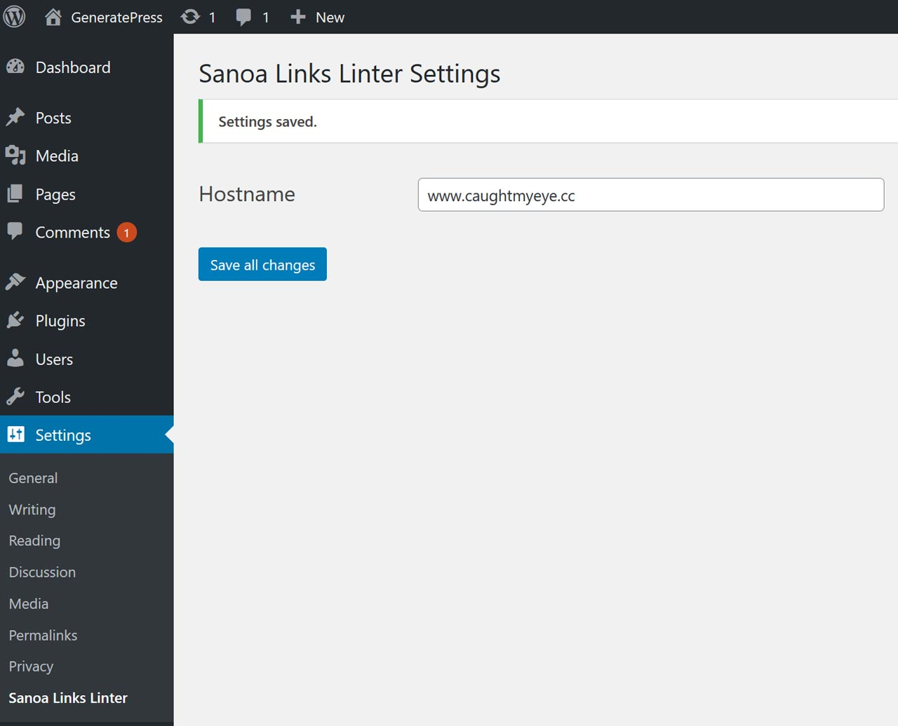

# Sanoa Links Linter

The _Sanoa Links Linter_ WordPress plugin does two things:

1. Makes all external links open in a new tab with noreferrer noopener attributes.
1. Makes all internal links open in the same tab.

This is useful if you’re a web developer or site owner that wants all site links to open the same way.

It’s important to note that having the noreferrer noopener attributes for external links is a [safe practice](https://www.wpbeginner.com/beginners-guide/what-is-relnoopener-in-wordpress-explained/). Since version 5.1, WordPress automatically adds these attributes for all external links.

---

## Settings Page

---

### I'll Drink to That ;-)

