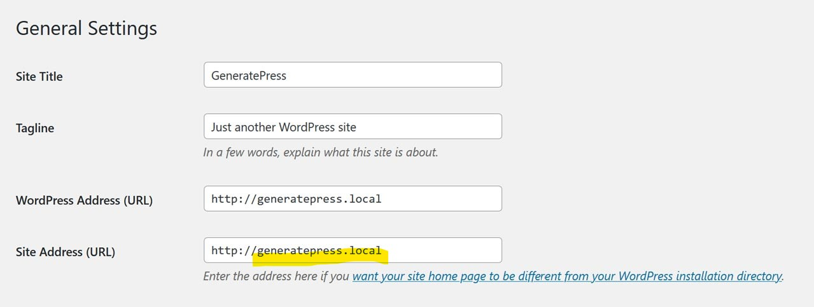

# Sanoa Links Linter (SLL)

The _Sanoa Links Linter_ WordPress plugin does two things:

1. Makes all external links open in a new tab with the _noreferrer noopener_ attributes.
1. Makes all internal links open in the same tab.

This is useful if you’re a web developer or site owner that wants all site links to open the same way.

It’s important to note that having the _noreferrer noopener_ attributes for external links is a [safe practice](https://www.wpbeginner.com/beginners-guide/what-is-relnoopener-in-wordpress-explained/). Since version 5.1, WordPress automatically adds these attributes for all links that open in a new tab.

---

## Usage

By default, the **Hostname** setting on admin settings page is set to the hostname from the **Site Address**. The **Hostname** setting is how the linter plugin knows what are considered internal and external links. 

If the _domain_ of a link matches the **Hostname** setting, then it's an internal link. The link will open in the same tab.

If the _domain_ of a link does **not** match the **Hostname** setting, then it's an external link. The link will open in a new tab and is protected by the _noreferrer noopener_ attributes.

When changing the **Hostname** setting, please do **not** include the `https://`. 

Correct: `balistreetphotographer.com`

Incorrect: `https://balistreetphotographer.com`

---

## Settings Page

**Note**: No `https://` is in the hostname.

If SLL finds a link in a page/post that has a different hostname, it will be treated as an external link. Otherwise, it's treated as an internal link. The default hostname setting comes from the domain name in the WordPress site URL setting. 

---

### I'll Drink to That ;-)

